# 瘋狂醫院 2（Crazy Hospital 2）病歷總覽（精簡症狀版）

本文件為瘋狂醫院2病歷參考（精簡症狀版）。
共收錄四個科別，合計 33（內科）+ 15（外科）+ 9（精神科）+ 8（整形科／婦產科）= 65 項病例。

**說明：**
- 症狀：列出該病例的可能症狀
- 異常檢查：僅列出結果異常的項目；其餘均為正常
- 正確治療：列出有效的治療方式及對應藥物（只需使用其中之一即可治療成功）

---

## 內科

### 內科 第 01 號：登革熱

**症狀：**
發燒、畏寒發冷、頭痛、頭暈目眩、食慾不振、肌肉骨骼痠痛、嗜睡想睡、疲倦無力、皮疹紅疹、眼睛不適、全身不適

**異常檢查：**
- 驗血：白血球含量 太低、血小板凝固機能 太低
- 視診：大腿紅疹
- 量體溫：約 39.5°C

**正確治療：**
- 吃藥 → 阿斯匹靈 / 解熱鎮痛劑
- 肛門塞劑 → 肛門退燒栓劑

---

### 內科 第 02 號：肺栓塞

**症狀：**
咳血、發燒、畏寒發冷、食慾不振、消化不良胃不適、一直放屁、咳嗽、呼吸困難、胸痛胸悶、心悸心律異常、失眠、嗜睡想睡、疲倦無力、全身不適

**異常檢查：**
- X光檢查：肺部攝影異常 

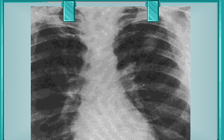
- 動脈血氧試驗：低血氧
- 心電圖：波形異常
- 量體溫：約 38.5°C

**正確治療：**
- 吃藥 → 鎮靜劑 / 抗凝血劑 / 毛地黃
- 靜脈注射 → 肝素 / 毛地黃
- 肛門塞劑 → 肛門退燒栓劑

---

### 內科 第 03 號：膽囊炎

**症狀：**
嘔吐、噁心想吐、發燒、畏寒發冷、食慾不振、腹痛、腹脹、咳嗽、呼吸困難、心悸心律異常、肌肉骨骼痠痛、臉色蒼白、焦慮煩躁不安、疲倦無力、顫抖、全身不適

**異常檢查：**
- 驗血：白血球含量 太高
- 觸診：腹部疼痛

**正確治療：**
- 靜脈注射 → 抗生素
- 肌肉注射 → 止痛劑
- 打點滴 → 葡萄糖

---

### 內科 第 04 號：肺癌

**症狀：**
咳血、複視、發燒、頭痛、體重減輕、咳嗽、痰、流鼻水鼻塞、胸痛胸悶、焦慮煩躁不安、疲倦無力、眼睛不適

**異常檢查：**
- 驗痰：異常 

- X光檢查：肺部攝影異常  

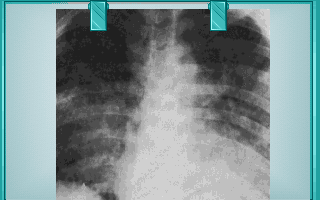
- 支氣管鏡檢查：異常　

- 量體溫：約 38.5°C

**正確治療：**
- 放射線療法
- 肛門塞劑 → 肛門退燒栓劑

---

### 內科 第 05 號：心律不整

**症狀：**
頭痛、頭暈目眩、耳鳴、食慾不振、消化不良胃不適、呼吸困難、流鼻水鼻塞、胸痛胸悶、心悸心律異常、肌肉骨骼痠痛、出汗冒汗、失眠、焦慮煩躁不安、疲倦無力、全身不適

**異常檢查：**
- 心電圖：不規則

**正確治療：**
- 靜脈注射 → 抗心律不整藥

---

### 內科 第 06 號：心絞痛

**症狀：**
食慾不振、消化不良胃不適、呼吸困難、胸痛胸悶、心悸心律異常、出汗冒汗、失眠、全身不適

**異常檢查：** 全部正常

**正確治療：**
- 吃藥 → 血管擴張劑

---

### 內科 第 07 號：A型肝炎

**症狀：**
營養不良、黃疸、嘔吐、噁心想吐、發燒、食慾不振、腹痛、腹脹、大便異常、呼吸困難、精神不振

**異常檢查：**
- 驗血：抗 A 型肝炎病毒血清陽性
- 超音波檢查：異常 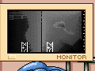
- 量體溫：約 38.5°C

**正確治療：**
- 肌肉注射 → 免疫血清球蛋白
- 肛門塞劑 → 肛門退燒栓劑

---

### 內科 第 08 號：B型肝炎

**症狀：**
黃疸、嘔吐、噁心想吐、食慾不振、腹痛、消化不良胃不適、咳嗽、呼吸困難、流鼻水鼻塞、嗜睡想睡、疲倦無力、皮疹紅疹、皮膚搔癢

**異常檢查：**
- 驗血：抗 B 型肝炎病毒血清陽性
- 視診：大腿紅疹

**正確治療：**
- 肌肉注射 → 人類球蛋白

---

### 內科 第 09 號：感冒

**症狀：**
黃疸、發燒、畏寒發冷、頭痛、頭暈目眩、耳鳴、食慾不振、腹痛、咳嗽、痰、流鼻水鼻塞、喉嚨痛聲啞、肌肉骨骼痠痛、臉色蒼白、疲倦無力、眼睛不適

**異常檢查：**
- 視診：口腔發炎（變紅）
- 量體溫：約 38.5°C

**正確治療：**
- 吃藥 → 風熱友 / 綜合感冒藥
- 肛門塞劑 → 肛門退燒栓劑

---

### 內科 第 10 號：猛爆型肝炎

**症狀：**
黃疸、體重減輕、食慾不振、肌肉骨骼痠痛、頻尿、嗜睡想睡、焦慮煩躁不安、疲倦無力、皮膚搔癢、眼睛不適、全身不適

**異常檢查：**
- 超音波檢查：異常 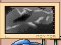

**正確治療：**
- 吃藥 → 腎上腺皮膚類固醇
- 肌肉注射 → 免疫血清球蛋白

---

### 內科 第 11 號：潰瘍性結腸炎

**症狀：**
嘔吐、噁心想吐、腹瀉、體重減輕、食慾不振、腹痛、臉色蒼白、疲倦無力、眼睛不適、全身不適

**異常檢查：**
- 驗血：紅血球含量 太低、鈣質含量 太低
- X光檢查：腹部攝影異常  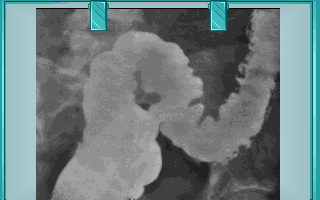
- 結腸鏡檢查：異常 

**正確治療：**
- 吃藥 → 腎上腺皮膚類固醇 / 香蕉 / 消炎藥

---

### 內科 第 12 號：德國麻疹

**症狀：**
發燒、食慾不振、腹痛、疲倦無力、皮疹紅疹、皮膚搔癢、皮膚病變、頸部腫塊、全身不適

**異常檢查：**
- 驗血：德國麻疹病毒陽性
- 視診：大腿紅疹
- 量體溫：約 38.5°C

**正確治療：**
- 吃藥 → 阿斯匹靈

---

### 內科 第 13 號：麻疹

**症狀：**
發燒、頭痛、體重增加、食慾亢進、消化不良胃不適、便秘、咳嗽、流鼻水鼻塞、焦慮煩躁不安、疲倦無力、皮疹紅疹、眼睛不適

**異常檢查：**
- 視診：口腔起泡、大腿紅疹
- 量體溫：太高（約 39.5°C，高燒）

**正確治療：**
- 肌肉注射 → 丙種球蛋白
- 肛門塞劑 → 肛門退燒栓劑

---

### 內科 第 14 號：蟯蟲病

**症狀：**
肛門癢、頭暈目眩、耳鳴、食慾不振、腹痛、肌肉骨骼痠痛、臉色蒼白、失眠、嗜睡想睡、焦慮煩躁不安、皮膚病變、全身不適

**異常檢查：**
- 糞便檢查：蟯蟲卵 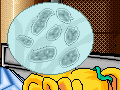

**正確治療：**
- 吃藥 → 軀蟲藥

---

### 內科 第 15 號：蛔蟲病

**症狀：**
營養不良、噁心想吐、腹瀉、發燒、頭痛、食慾不振、腹痛、咳嗽、流鼻水鼻塞、吞嚥困難、臉色蒼白、嗜睡想睡、焦慮煩躁不安、疲倦無力、全身不適

**異常檢查：**
- 糞便檢查：蛔蟲卵 

**正確治療：**
- 吃藥 → 軀蟲藥

---

### 內科 第 16 號：日本腦炎

**症狀：**
複視、牙關緊閉、嘔吐、噁心想吐、發燒、頭痛、肌肉骨骼痠痛、吞嚥困難、嗜睡想睡、眼睛不適、抽搐痙攣、肌肉僵硬、麻痺感覺異常、全身不適

**異常檢查：**
- 驗血：HI滴定值 太高、CF滴定值 太高
- 量體溫：約 38.5°C

**正確治療：**
- 吃藥 → 消炎藥
- 打點滴 → 降腦壓藥

---

### 內科 第 17 號：泌尿道感染

**症狀：**
血尿、噁心想吐、發燒、食慾不振、流鼻水鼻塞、肌肉骨骼痠痛、排尿困難、頻尿、臉色蒼白、失眠、焦慮煩躁不安、疲倦無力

**異常檢查：**
- 尿液檢查：尿蛋白含量 太高、細菌含量 太高、白血球含量 太高
- 量體溫：約 38.5°C

**正確治療：**
- 吃藥 → 消炎藥
- 靜脈注射 → 抗生素
- 肛門塞劑 → 肛門退燒栓劑

---

### 內科 第 18 號：破傷風

**症狀：**
牙關緊閉、食慾不振、肌肉骨骼痠痛、頻尿、吞嚥困難、臉色蒼白、抽搐痙攣、肌肉僵硬、麻痺感覺異常、全身不適

**異常檢查：**
- 細菌培養：陽性 

**正確治療：**
- 靜脈注射 → 青黴素
- 肌肉注射 → 破傷風疫苗

---

### 內科 第 19 號：狂犬病

**症狀：**
發燒、肌肉骨骼痠痛、焦慮煩躁不安、精神不振、疲倦無力、抽搐痙攣、麻痺感覺異常、流口水

**異常檢查：**
- 細菌培養：陽性 
- 量體溫：約 38.5°C

**正確治療：**
- 肌肉注射 → 破傷風疫苗 / 狂犬病血清
- 塗藥 → 消毒藥水
- 肛門塞劑 → 肛門退燒栓劑

---

### 內科 第 20 號：食物過敏

**症狀：**
嘔吐、噁心想吐、腹瀉、頭痛、食慾不振、腹痛、咳嗽、呼吸困難、流鼻水鼻塞、皮疹紅疹、皮膚搔癢、眼睛不適、全身不適

**異常檢查：**
- 視診：大腿紅疹
- 過敏原挑戰試驗：陽性

**正確治療：**
- 吃藥 → 抗過敏藥

---

### 內科 第 21 號：過敏性鼻炎

**症狀：**
頭暈目眩、食慾不振、腹痛、咳嗽、流鼻水鼻塞、肌肉骨骼痠痛、失眠、嗜睡想睡、焦慮煩躁不安、疲倦無力、皮疹紅疹、皮膚搔癢、眼睛不適、全身不適

**異常檢查：**
- 視診：鼻孔發炎

**正確治療：**
- 吃藥 → 風熱友 / 康德600 / 綜合感冒藥

---

### 內科 第 22 號：重症肌無力

**症狀：**
牙關緊閉、腹瀉、食慾不振、腹痛、吞嚥困難、臉色蒼白、嗜睡想睡、焦慮煩躁不安、精神不振、疲倦無力、行動困難

**異常檢查：** 全部正常

**正確治療：**
- 肌肉注射 → 自主神經藥

---

### 內科 第 23 號：鉛中毒

**症狀：**
嘔吐、噁心想吐、頭痛、體重減輕、食慾不振、腹痛、便秘、肌肉骨骼痠痛、焦慮煩躁不安、疲倦無力、抽搐痙攣、行動困難

**異常檢查：**
- 驗血：鉛質含量 太高
- 尿液檢查：鉛含量 太高

**正確治療：**
- 吃藥 → 緩瀉劑 / 口服盤尼西林
- 肌肉注射 → 抗毒劑
- 打點滴 → 葡萄糖

---

### 內科 第 24 號：慢性腎衰竭

**症狀：**
嘔吐、噁心想吐、腹瀉、頭痛、頭暈目眩、食慾不振、消化不良胃不適、臉色蒼白、黑眼圈、失眠、嗜睡想睡、焦慮煩躁不安、疲倦無力、皮膚搔癢、皮膚病變、眼睛不適、抽搐痙攣

**異常檢查：**
- 驗血：腎功能檢測 太低
- 視診：大腿脫皮
- 量血壓：低血壓
- 動脈血氧試驗：電解質不平衡

**正確治療：**
- 吃藥 → 胃乳 / 維生素

---

### 內科 第 25 號：貧血

**症狀：**
頭痛、頭暈目眩、食慾不振、肌肉骨骼痠痛、尿少、吞嚥困難、臉色蒼白、嗜睡想睡、焦慮煩躁不安、精神不振、疲倦無力、眼睛不適、全身不適

**異常檢查：**
- 驗血：紅血球含量 太低

**正確治療：**
- 吃藥 → 維生素
- 打點滴 → 輸血

---

### 內科 第 26 號：白血病

**症狀：**
嘔吐、發燒、頭痛、頭暈目眩、體重減輕、食慾不振、腹痛、肌肉骨骼痠痛、臉色蒼白、疲倦無力、皮膚病變、容易瘀青出血、顫抖、全身不適

**異常檢查：**
- 驗血：紅血球含量 太低
- 視診：舌下紅腫
- 超音波檢查：異常
- 量體溫：約 38.5°C

**正確治療：**
- 放射線療法
- 打點滴 → 輸血 / 葡萄糖
- 肛門塞劑 → 肛門退燒栓劑

---

### 內科 第 27 號：尿崩症

**症狀：**
發燒、頭痛、體重減輕、食慾不振、口渴、頻尿、臉色蒼白、焦慮煩躁不安、精神不振、疲倦無力、皮膚病變、全身不適

**異常檢查：**
- 驗血：鈉質含量 太高、氯質含量 太高
- 視診：口腔舌頭龜裂
- 尿液檢查：尿液比重 太低

**正確治療：**
- 肌肉注射 → 血管增壓素

---

### 內科 第 28 號：關節炎

**症狀：**
頭暈目眩、肌肉骨骼痠痛、出汗冒汗、焦慮煩躁不安、疲倦無力、皮膚病變、抽搐痙攣、站立困難、行動困難、全身不適

**異常檢查：**
- X光檢查：關節攝影異常 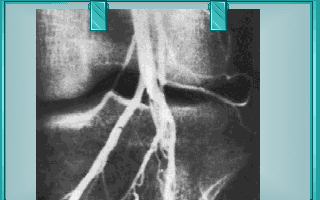

**正確治療：**
- 吃藥 → 阿斯匹靈 / 腎上腺皮膚類固醇

---

### 內科 第 29 號：霍亂

**症狀：**
嘔吐、噁心想吐、腹瀉、頭痛、頭暈目眩、食慾不振、腹痛、出汗冒汗、焦慮煩躁不安、疲倦無力、皮膚病變、顫抖、全身不適

**異常檢查：**
- 驗血：鉀質含量 太低、鈉質含量 太低、氯質含量 太低
- 糞便檢查：霍亂弧菌 
- 動脈血氧試驗：低血氧

**正確治療：**
- 靜脈注射 → 四環黴素
- 肌肉注射 → 氯黴素
- 打點滴 → 葡萄糖

---

### 內科 第 30 號：水痘

**症狀：**
噁心想吐、發燒、頭痛、頭暈目眩、食慾不振、出汗冒汗、失眠、焦慮煩躁不安、疲倦無力、皮疹紅疹、皮膚搔癢、皮膚病變、全身不適

**異常檢查：**
- 視診：大腿紅疹
- 量體溫：約 38.5°C

**正確治療：**
- 塗藥 → 痱子膏
- 肛門塞劑 → 肛門退燒栓劑

---

### 內科 第 31 號：瘧疾

**症狀：**
畏寒發冷、頭痛、頭暈目眩、口渴、消化不良胃不適、出汗冒汗、失眠、焦慮煩躁不安、疲倦無力、眼睛不適、顫抖、全身不適

**異常檢查：**
- 驗血：白血球含量 太低、紅血球含量 太低
- 超音波檢查：異常  

**正確治療：**
- 吃藥 → 氯奎寧
- 肌肉注射 → 止痛劑
- 打點滴 → 葡萄糖
- 肛門塞劑 → 肛門退燒栓劑

---

### 內科 第 32 號：梅毒

**症狀：**
發燒、喉嚨痛聲啞、肌肉骨骼痠痛、分泌物增多、皮疹紅疹、長瘡、下疳、皮膚病變、眼睛不適

**異常檢查：**
- 驗血：紅血球含量 太低、梅毒血清病毒陽性
- 視診：大腿異常

**正確治療：**
- 局部電燒（無需選藥物）
- 肌肉注射 → 盤尼西林

---

### 內科 第 33 號：香港腳

**症狀：**
皮膚病變、香港腳、全身不適

**異常檢查：**
- 視診：腳底脫皮、紅斑

**正確治療：**
- 塗藥 → 悠悠藥膏 / 足爽

---

## 外科

### 外科 第 01 號：尿石病

**症狀：**
血尿、嘔吐、噁心想吐、腹瀉、發燒、畏寒發冷、食慾不振、腹痛、消化不良胃不適、肌肉骨骼痠痛、排尿困難、臉色蒼白、失眠、焦慮煩躁不安、顫抖、全身不適

**異常檢查：**
- 驗血：鈣含量 太高、白血球含量 太高
- 膀胱鏡：異常 
- 尿液檢查：鈣含量 太高、尿蛋白含量 太高
- 量體溫：太高（約 38.5°C，微燒）

**正確治療：**
- 吃藥 → 降尿酸藥物
- 靜脈注射 → 嗎啡
- 打點滴 → 葡萄糖

---

### 外科 第 02 號：肝硬化

**症狀：**
黃疸、嘔吐、噁心想吐、頭痛、頭暈目眩、體重減輕、食慾不振、腹痛、消化不良胃不適、臉色蒼白、失眠、嗜睡想睡、焦慮煩躁不安、精神不振、疲倦無力

**異常檢查：**
- 驗血：鈉含量 太高、鉀含量 太低、白血球含量 太低、血小板含量 太低、血紅素含量 太低、血清球蛋白含量 太高

**正確治療：**
- 吃藥 → 綜合維生素 / 葉酸 / 鐵劑（任一有效）
- 打點滴 → 葡萄糖

---

### 外科 第 03 號：肝癌

**症狀：**
營養不良、黃疸、噁心想吐、頭痛、頭暈目眩、體重減輕、食慾不振、腹痛、腹脹、失眠、嗜睡想睡、焦慮煩躁不安、精神不振、疲倦無力、全身不適

**異常檢查：**
- 驗血：白血球含量 太高、紅血球沈降率 太高
- 腹部扣診：腹部疼痛
- X光檢查：肝臟攝影異常 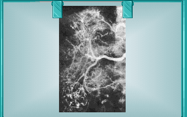
- 超音波檢查：異常 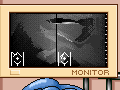

**正確治療：**
- 吃藥 → 抗癌藥物
- 打點滴 → 葡萄糖

---

### 外科 第 04 號：膽結石

**症狀：**
黃疸、噁心想吐、腹瀉、頭痛、頭暈目眩、腹痛、腹脹、消化不良胃不適、便秘、失眠、焦慮煩躁不安、精神不振、疲倦無力、站立困難

**異常檢查：**
- 超音波檢查：異常（膽結石可見）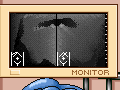

**正確治療：**
- 手術治療 → 膽囊切除術

---

### 外科 第 05 號：甲狀腺炎

**症狀：**
發燒、畏寒發冷、頭痛、體重減輕、咳嗽、呼吸困難、流鼻水鼻塞、喉嚨痛聲啞、心悸心律異常、吞嚥困難、失眠、焦慮煩躁不安、精神不振、疲倦無力、眼睛不適、肌肉僵硬、顫抖、頸部腫塊、全身不適

**異常檢查：**
- 驗血：甲狀腺素含量 太高、碘濃度 太低、甲狀腺剌激荷爾蒙 太低
- 基礎代謝率：異常
- 量體溫：約 38.5°C

**正確治療：**
- 吃藥 → 阿斯匹靈
- 靜脈注射 → 皮質荷爾蒙

---

### 外科 第 06 號：甲狀腺風暴

**症狀：**
腹瀉、體重減輕、腹痛、呼吸困難、胸痛胸悶、心悸心律異常、失眠、焦慮煩躁不安、精神不振、疲倦無力、腫脹水腫、全身不適

**異常檢查：**
- 心電圖：心跳過快
- 量體溫：約 40.5°C

**正確治療：**
- 吃藥 → 維生素 B / 甲狀腺荷爾蒙 / 降血壓藥
- 靜脈注射 → 毛地黃

---

### 外科 第 07 號：紫斑症

**症狀：**
頭痛、頭暈目眩、食慾亢進、肌肉骨骼痠痛、失眠、嗜睡想睡、焦慮煩躁不安、疲倦無力、容易瘀青出血、腫脹水腫、血管痛、全身不適

**異常檢查：**
- 驗血：血小板含量 太低
- 量體溫：約 38.5°C

**正確治療：**
- 吃藥 → 肌肉鬆馳劑 / 止痛劑 / 維他命 D / 鈣片
- 靜脈注射 → 皮質荷爾蒙
- 肌肉注射 → 性荷爾蒙

---

### 外科 第 08 號：靜脈曲張

**症狀：**
肌肉骨骼痠痛、失眠、焦慮煩躁不安、精神不振、疲倦無力、容易瘀青出血、抽搐痙攣、腫脹水腫、站立困難、靜脈曲張、血管痛、行動困難、全身不適

**異常檢查：**
- 視診：小腿靜脈曲張異常

**正確治療：**
- 手術治療 → 內部靜脈剝除術

---

### 外科 第 09 號：心肌炎

**症狀：**
發燒、頭痛、呼吸困難、流鼻水鼻塞、胸痛胸悶、心悸心律異常、肌肉骨骼痠痛、失眠、嗜睡想睡、焦慮煩躁不安、疲倦無力、全身不適

**異常檢查：**
- 心電圖：心跳不規則且過快

**正確治療：**
- 靜脈注射 → 青黴素
- 打點滴 → 葡萄糖

---

### 外科 第 10 號：心包膜炎

**症狀：**
發燒、頭暈目眩、呼吸困難、流鼻水鼻塞、胸痛胸悶、心悸心律異常、肌肉骨骼痠痛、臉色蒼白、出汗冒汗、失眠、嗜睡想睡、焦慮煩躁不安、精神不振、疲倦無力、顫抖、頸部腫塊、全身不適

**異常檢查：**
- 驗血：白血球含量 太高

**正確治療：**
- 吃藥 → 阿斯匹靈
- 靜脈注射 → 嗎啡

---

### 外科 第 11 號：急性肺水腫

**症狀：**
咳嗽、痰、呼吸困難、流鼻水鼻塞、臉色蒼白、出汗冒汗、手腳冰冷、失眠、焦慮煩躁不安、精神不振、疲倦無力、顫抖、指甲變色、全身不適

**異常檢查：**
- 量血壓：低血壓

**正確治療：**
- 靜脈注射 → 嗎啡 / 利尿劑 / 阿米諾非林
- 打點滴 → 葡萄糖

---

### 外科 第 12 號：消化性潰瘍

**症狀：**
嘔吐、噁心想吐、頭痛、腹痛、消化不良胃不適、流鼻水鼻塞、心悸心律異常、肌肉骨骼痠痛、臉色蒼白、失眠、焦慮煩躁不安、精神不振、疲倦無力、顫抖、全身不適

**異常檢查：**
- X光檢查：胃部攝影異常 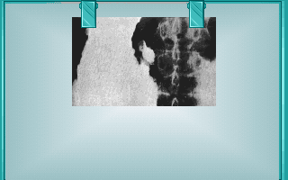
- 糞便檢查：糞便有血
- 胃鏡檢查：紅色潰瘍 

**正確治療：**
- 吃藥 → 胃乳 / 胃片

---

### 外科 第 13 號：胃癌

**症狀：**
黃疸、嘔吐、噁心想吐、體重減輕、食慾不振、腹痛、大便異常、肌肉骨骼痠痛、吞嚥困難、臉色蒼白、失眠、焦慮煩躁不安、疲倦無力、指甲變色、全身不適

**異常檢查：**
- X光檢查：胃部攝影異常 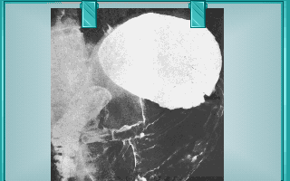
- 糞便檢查：糞便有血
- 胃鏡檢查：癌細胞 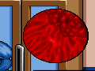

**正確治療：**
- 放射線治療

---

### 外科 第 14 號：甲狀腺癌

**症狀：**
噁心想吐、腹瀉、體重減輕、腹痛、腸蠕動增加、呼吸困難、喉嚨痛聲啞、心悸心律異常、肌肉骨骼痠痛、吞嚥困難、出汗冒汗、失眠、焦慮煩躁不安、顫抖、頸部腫塊

**異常檢查：**
- 驗血：甲狀腺素含量 太高
- 心電圖：心跳過快
- 量血壓：低血壓
- X光檢查：頸部攝影異常 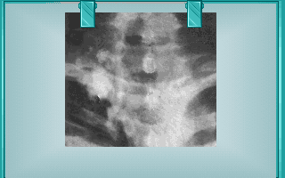

**正確治療：**
- 吃藥 → 甲狀腺荷爾蒙
- 放射線治療

---

### 外科 第 15 號：盲腸炎

**症狀：**
嘔吐、噁心想吐、發燒、畏寒發冷、食慾不振、腹痛、喉嚨痛聲啞、心悸心律異常、臉色蒼白、出汗冒汗、失眠、焦慮煩躁不安、顫抖、頸部腫塊、全身不適

**異常檢查：**
- 腹部扣診：下腹部疼痛
- 量體溫：約 38.5°C

**正確治療：**
- 手術治療 → 闌尾切除術

---

## 精神科

> 精神科無驗血等一般檢查，改以四種行為試驗評估。
> 每項試驗隨機從 3 個變體中選一。
> 治療選項：吃藥、電療、心理治療、隔離。

### 精神科 第 01 號：妄想症

**行為特徵（摘要）：**

- 一般症狀：神經質、人緣差、脾氣暴躁、常胡思亂想
- 睡眠狀況：多半失眠
- 人際關係：對他人極度猜疑、有被害妄想
- 自我傷害：會攻擊他人，也有自傷與自殺傾向
- 自我信任：極度自我中心、自視甚高
- 人生態度：否認患病、拒絕就醫
- 呈現自我：自我意識強烈、言行偏怪、好與人衝突

**試驗結果（各變體）：**

| 試驗 | 變體 1 | 變體 2 | 變體 3 |
|------|-------|-------|-------|
| 暴力傾向試驗 | 輕度異常 | 恐懼 | 攻擊性 |
| 反射神經試驗 | 極度過激 | 極度過激 | 極度過激 |
| 自我傷害試驗 | 強衝動 | 強衝動 | 強衝動 |
| 奇異行為試驗 | 妄想 | 妄想 | 輕度異常 |

**正確治療：**
- 隔離
- 吃藥 → 抗精神病藥 / 安眠藥

---

### 精神科 第 02 號：憂鬱症

**行為特徵（摘要）：**

- 一般症狀：行動遲緩、呆滯、記憶力差
- 睡眠狀況：睡眠失調（嗜睡或失眠）
- 人際關係：退縮、不與人往來
- 自我傷害：有強烈自殺念頭
- 自我信任：極度自卑、覺得人生無望
- 人生態度：悲觀消極、對一切失去興趣
- 呈現自我：自我封閉、覺得自己多餘累贅

**試驗結果（各變體）：**

| 試驗 | 變體 1 | 變體 2 | 變體 3 |
|------|-------|-------|-------|
| 暴力傾向試驗 | 輕度異常 | 恐懼 | 恐懼 |
| 反射神經試驗 | 正常 | 正常 | 正常 |
| 自我傷害試驗 | 自我傷害 | 自我傷害 | 自我傷害 |
| 奇異行為試驗 | 輕度異常 | 輕度異常 | 輕度異常 |

**正確治療：**
- 電療
- 隔離
- 吃藥 → 抗精神病藥 / 抗焦慮劑 / 抗鬱劑 / 安眠藥

---

### 精神科 第 03 號：躁症

**行為特徵（摘要）：**

- 一般症狀：過動、坐立不安、無法專心
- 睡眠狀況：精力旺盛、幾乎不睡
- 人際關係：熱情外向、過度慷慨愛管閒事
- 自我傷害：攻擊他人但不傷害自己
- 自我信任：只相信自己、不信任他人
- 人生態度：極度樂觀、自我膨脹
- 呈現自我：誇張外放、行為失序

**試驗結果（各變體）：**

| 試驗 | 變體 1 | 變體 2 | 變體 3 |
|------|-------|-------|-------|
| 暴力傾向試驗 | 輕度異常 | 輕度異常 | 輕度異常 |
| 反射神經試驗 | 正常 | 遲鈍 | 遲鈍 |
| 自我傷害試驗 | 困惑 | 困惑 | 困惑 |
| 奇異行為試驗 | 狂躁 | 狂躁 | 無反應 |

**正確治療：**
- 電療
- 隔離
- 吃藥 → 抗焦慮劑 / 安眠藥

---

### 精神科 第 04 號：恐懼症

**行為特徵（摘要）：**

- 一般症狀：對特定事物極度恐懼，並伴隨身體反應
- 睡眠狀況：大致正常、偶爾失眠
- 人際關係：略為退縮、少與人交談
- 自我傷害：無自傷傾向
- 自我信任：自我信任正常或偏高
- 人生態度：凡事畏懼、退縮不前
- 呈現自我：容易緊張、神情不安

**試驗結果（各變體）：**

| 試驗 | 變體 1 | 變體 2 | 變體 3 |
|------|-------|-------|-------|
| 暴力傾向試驗 | 恐懼 | 恐懼 | 恐懼 |
| 反射神經試驗 | 正常 | 正常 | 正常 |
| 自我傷害試驗 | 困惑 | 困惑 | 困惑 |
| 奇異行為試驗 | 輕度異常 | 輕度異常 | 輕度異常 |

**正確治療：**
- 心理治療
- 隔離
- 吃藥 → 抗焦慮劑

---

### 精神科 第 05 號：強迫心理症

**行為特徵（摘要）：**

- 一般症狀：鑽牛角尖，並有強迫行為（如反覆洗手）
- 睡眠狀況：睡眠尚可、偶爾淺眠
- 人際關係：人際緊張、缺乏幽默感
- 自我傷害：無自傷傾向
- 自我信任：缺乏自信、常自我懷疑
- 人生態度：壓抑、迷信、覺得生活痛苦
- 呈現自我：固執守序、過度拘謹龜毛

**試驗結果（各變體）：**

| 試驗 | 變體 1 | 變體 2 | 變體 3 |
|------|-------|-------|-------|
| 暴力傾向試驗 | 輕度異常 | 輕度異常 | 輕度異常 |
| 反射神經試驗 | 正常 | 正常 | 正常 |
| 自我傷害試驗 | 困惑 | 困惑 | 困惑 |
| 奇異行為試驗 | 輕度異常 | 輕度異常 | 輕度異常 |

**正確治療：**
- 電療
- 心理治療
- 隔離
- 吃藥 → 抗焦慮劑

---

### 精神科 第 06 號：歇斯底理症

**行為特徵（摘要）：**

- 一般症狀：做作情緒化、健忘、性格多變
- 睡眠狀況：睡眠不穩（夢遊、淺眠）
- 人際關係：人緣差、愛埋怨他人
- 自我傷害：以受傷博取注意（多為作態）
- 自我信任：固執己見、只相信自己
- 人生態度：戲劇化、表裡不一
- 呈現自我：誇張賣弄、刻意引人注意

**試驗結果（各變體）：**

| 試驗 | 變體 1 | 變體 2 | 變體 3 |
|------|-------|-------|-------|
| 暴力傾向試驗 | 輕度異常 | 輕度異常 | 輕度異常 |
| 反射神經試驗 | 正常 | 正常 | 正常 |
| 自我傷害試驗 | 強衝動 | 強衝動 | 困惑 |
| 奇異行為試驗 | 狂躁 | 狂躁 | 狂躁 |

**正確治療：**
- 電療
- 心理治療

---

### 精神科 第 07 號：心身症

**行為特徵（摘要）：**

- 一般症狀：多種身體不適（頭痛、心悸、過敏等）
- 睡眠狀況：因焦慮而失眠
- 人際關係：自卑、人際關係差
- 自我傷害：有自傷或自殺傾向
- 自我信任：信任度兩極（自負或不信任他人）
- 人生態度：悲觀消極、自暴自棄
- 呈現自我：缺乏自信、行為誇張、諸多不滿

**試驗結果（各變體）：**

| 試驗 | 變體 1 | 變體 2 | 變體 3 |
|------|-------|-------|-------|
| 暴力傾向試驗 | 輕度異常 | 恐懼 | 輕度異常 |
| 反射神經試驗 | 正常 | 正常 | 正常 |
| 自我傷害試驗 | 自我傷害 | 自我傷害 | 困惑 |
| 奇異行為試驗 | 輕度異常 | 輕度異常 | 輕度異常 |

**正確治療：**
- 心理治療

---

### 精神科 第 08 號：自閉症

**行為特徵（摘要）：**

- 一般症狀：行為怪異退化、記憶力差、常伴幻聽
- 睡眠狀況：失眠、難以入睡
- 人際關係：多疑孤僻、不與人往來
- 自我傷害：有自傷或自殺傾向
- 自我信任：過度自信，甚至相信幻聽
- 人生態度：冷漠悲觀、與世隔絕
- 呈現自我：與現實脫節、自我感喪失

**試驗結果（各變體）：**

| 試驗 | 變體 1 | 變體 2 | 變體 3 |
|------|-------|-------|-------|
| 暴力傾向試驗 | 輕度異常 | 恐懼 | 恐懼 |
| 反射神經試驗 | 極度過激 | 極度過激 | 極度過激 |
| 自我傷害試驗 | 強衝動 | 強衝動 | 強衝動 |
| 奇異行為試驗 | 狂躁 | 狂躁 | 狂躁 |

**正確治療：**
- 吃藥 → 抗焦慮劑 / 安眠藥

---

### 精神科 第 09 號：神經衰弱

**行為特徵（摘要）：**

- 一般症狀：易緊張暴躁、伴隨多種身體不適
- 睡眠狀況：失眠、淺眠
- 人際關係：人際淡薄、與同事不睦
- 自我傷害：無自傷傾向
- 自我信任：自信偏高
- 人生態度：易疲倦、精神不集中、有挫折感
- 呈現自我：煩躁不安、過度關注自身健康

**試驗結果（各變體）：**

| 試驗 | 變體 1 | 變體 2 | 變體 3 |
|------|-------|-------|-------|
| 暴力傾向試驗 | 輕度異常 | 輕度異常 | 輕度異常 |
| 反射神經試驗 | 攻擊性 | 攻擊性 | 正常 |
| 自我傷害試驗 | 困惑 | 困惑 | 困惑 |
| 奇異行為試驗 | 輕度異常 | 輕度異常 | 輕度異常 |

**正確治療：**
- 吃藥 → 抗焦慮劑 / 安眠藥

---

## 整形科

> 整形科患者主動要求手術，無檢查及診斷階段。

### 整形科 第 01 號：隆乳

**患者主訴：**
- 我覺得我的胸部好小！希望能夠把它墊高一點。
- 我想接受隆乳手術！將我的胸部弄高一些。
- 我希望你能將我的胸部做得像葉子楣那麼大。

**手術：** 隆乳手術（Breast Augmentation）

---

### 整形科 第 02 號：拉皮

**患者主訴：**
- 我想要接受拉皮手術！以去除我臉上的皺紋。
- 最近臉上多了許多皺紋！請你幫我把它們除掉。
- 我想動手術來除掉臉上的皺紋！可以嗎？

**手術：** 拉皮手術（Face Lift）

---

### 整形科 第 03 號：隆鼻

**患者主訴：**
- 我覺得我的鼻子好扁！希望能夠把它墊高一些。
- 人家說鼻子大，福氣大！我想把鼻子改大一點。
- 我好喜歡鷹勾鼻！不知道你能不能幫我做一個？

**手術：** 隆鼻手術（Rhinoplasty）

---

### 整形科 第 04 號：割雙眼皮

**患者主訴：**
- 我想要割雙眼皮。
- 我想要割雙眼皮。
- 我想要割雙眼皮。

**手術：** 割雙眼皮手術（Double Eyelid Surgery）

---

## 婦產科

> 婦產科患者主動要求檢查或手術，無檢查及診斷階段。

### 婦產科 第 01 號：子宮抹片檢查

**患者主訴：**
- 我想做子宮抹片檢查。
- 我想做子宮抹片檢查。
- 我想做子宮抹片檢查。

**手術：** 子宮抹片檢查（Pap Smear）

---

### 婦產科 第 02 號：子宮內避孕器

**患者主訴：**
- 我想裝置子宮內避孕器。
- 我想裝置子宮內避孕器。
- 我想裝置子宮內避孕器。

**手術：** 子宮內避孕器置入（IUD Insertion）

---

### 婦產科 第 03 號：羊膜穿刺術

**患者主訴：**
- 我想要施行羊膜穿刺術！檢查胎兒是否正常。
- 我想要施行羊膜穿刺術！檢查胎兒是否正常。
- 我想要施行羊膜穿刺術！檢查胎兒是否正常。

**手術：** 羊膜穿刺術（Amniocentesis）

---

### 婦產科 第 04 號：結紮

**患者主訴：**
- 我要結紮。
- 我要結紮。
- 我要結紮。

**手術：** 輸卵管結紮術（Tubal Ligation）

---
