# 瘋狂醫院２超級醫生 — 手術攻略（Surgery Walkthrough）

> 本檔案整理《瘋狂醫院２超級醫生》四項開刀房手術的完整步驟
> 婦產科／整形科的「治療」手術列於文末（步驟尚待驗證）。

---

## 目錄
- [通用規則](#通用規則)
- [闌尾切除術 (Appendectomy)](#闌尾切除術)
- [膽囊切除術 (Cholecystectomy)](#膽囊切除術)
- [內部靜脈剝除術 (Vein Stripping)](#內部靜脈剝除術)
- [輸卵管結紮術 (Tubal Ligation)](#輸卵管結紮術)

---

## 通用規則

- **點擊方式：** 多數步驟為左鍵點擊／拖曳；少數步驟需**右鍵**（會特別註明）。用數字鍵盤移動遊標等於拖曳，在切割和縫合時較為方便（尤其是斜向操作時）。
- **下刀位置：** 需要開腹時，下刀的位置和角度（一共四種方向）並不會直接影響手術成敗。但會影響之後的可視範圍。若切開的位置跟需要治療的區域差距過大有可能無法成功進行所有步驟。此外，撐開的洞大小是固定的，並不是割開愈長就可以打開更大的範圍。同時，切開的長度過短也會造成無法打開傷口的情況。 
- **空手（不拿工具）：** 開皮層、打結、取下器械等步驟需要空手。在多數手術中，於需要工具的地方空手點擊
  不會有影響——**唯一例外是輸卵管結紮術的其中一步**（見該節警告）。
- **共同失敗條件：**
  - 切割時下刀太深／歪斜／偏離切線 → 出血失敗。
  - 縫合針數不足或縫在非切割處太多次（各手術門檻不同）。
  - 拖太久（病人耐心耗盡，左上的血袋耗盡）→ 逾時失敗。
  - 一旦達成失敗條件，就算完成所有步驟也會被判定治療失敗，請謹慎操作。
- **潛在遊戲BUG：**
  - 需要切開腹膜（第四層皮膚）時，對下刀位置的要求極為嚴格，必需跟切開皮膚的第一刀幾乎重合不然就會造成大出血導致手術失敗。用剪刀的判定會寬鬆一些但位置依然很難目測。建議修改op0.exe 繞過這個判定。

   | | |
   |---|---|
   | **File** | `Dr2/OP0.EXE` |
   | **Offset** | `0x77CA` (30666) |
   | **Original** | `75`  — `jne` (有失敗判定) |
   | **Patched** | `EB`  — `jmp` (無失敗判定) |
   | **Bytes changed** | 1 |
---

## 闌尾切除術
**Appendectomy** ｜ 外科手術

### 工具表
| 編號 | 工具 | 圖示 |
|---|---|---|
| f001 | 止血鉗 (Hemostat) |  |
| f002 | 剪刀 (Scissors) |  |
| f004 | 手術刀 (Scalpel) |  |
| f006 | 縫線／持針器 (Suture) |  |
| f007 | 鉗子 (Forceps) |  |
| f008 | 牽引器 (Retractor) |  |

### 步驟
**開腹（四層，前三層：手術刀切開 → 空手撥開）**
1. 用手術刀切開**皮膚**，再用手撥開。

    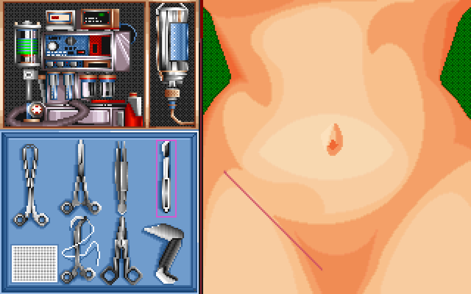

2. 用手術刀切開**皮下脂肪**，再用手撥開。

    

3. 用手術刀切開**肌肉**，再用手撥開。

    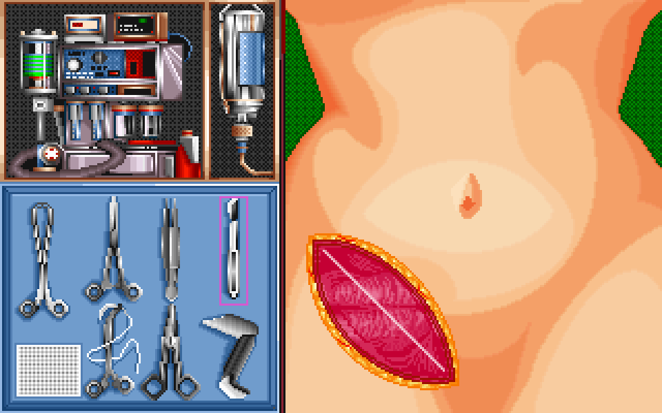

4. **用剪刀切開腹膜**

    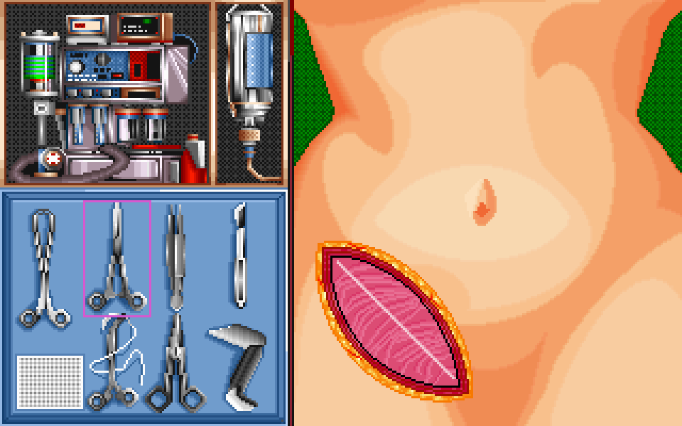

**體內處理**

5. 用牽引器撐開腹膜。

    
    

6. 用止血鉗拉出闌尾。

    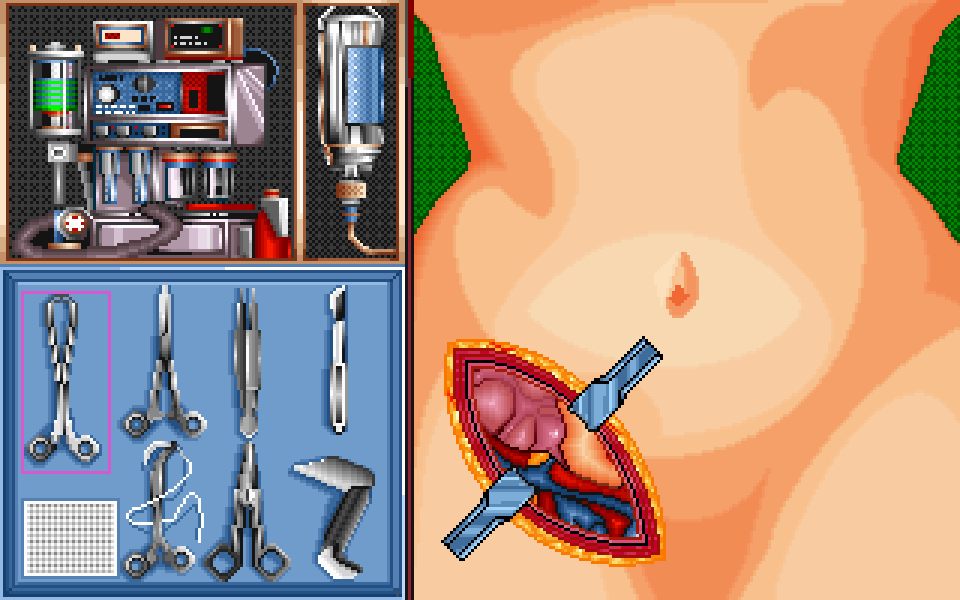

7. 用剪刀或手術刀沿畫線處切斷連結的膜（此處兩者皆可）。若切到其它區域，會引發大出血失敗。建議下刀時不要離邊緣太近，一旦切開了足夠的長度手術即可進入下一階段。

    

8. 用鉗子夾住闌尾尾端。用左鍵選取鉗子後在正確位置用**右鍵**放下鉗子。

    

9. 用縫線 (f006) 在闌尾根部打結（點擊一次即可）。

    

10. 用手術刀切斷闌尾（點擊一次即可）。這裡畫面上不會有變化，點擊完直接進行下一個步驟即可。

    

11. 空手取下鉗子。

    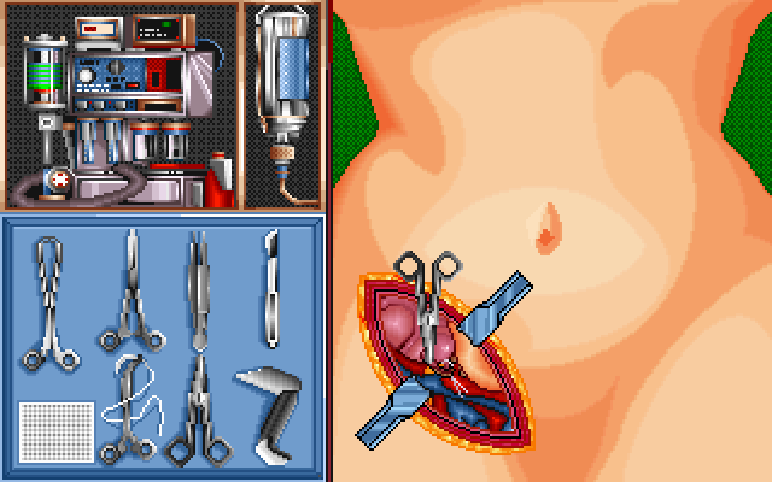

12. 用縫線縫合斷面（點擊一次即可）。

    

13. 空手點擊殘餘闌尾，將其塞入腸内。

    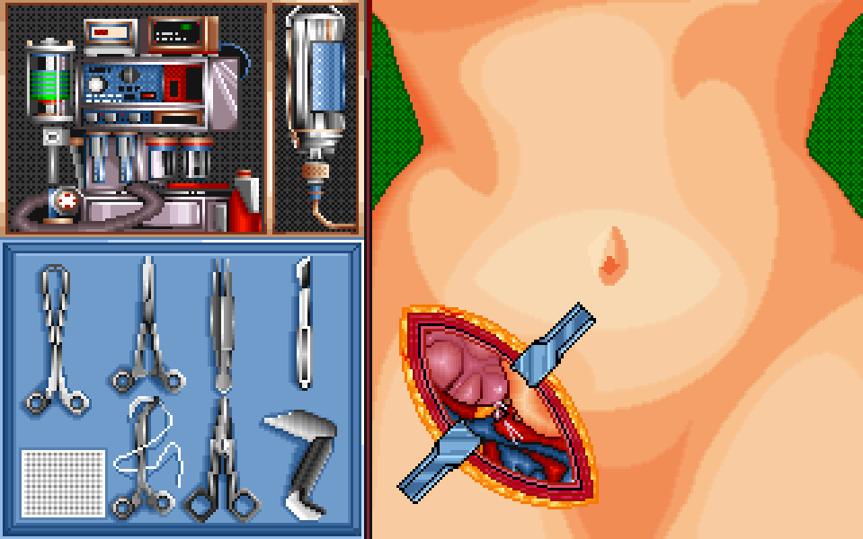

14. 用縫線縫合大腸尾端。

    

15. 空手取下牽引器。

    

16. 用縫線縫合傷口（沿著線縫，總針數 ≥ 10）。

    

17. 關閉麻醉（畫面左上角的機器）→ 結束。

### 失敗條件
- **用手術刀切割腹膜**（第 4 層）→ 必出血。請用剪刀。
- **亂縫合**：傷口縫合時，未縫在切割線上的次數 > 3 針。
- **縫合不足**：傷口縫合 < 10 針。
- 切割下刀太深／歪斜；逾時。

---

## 膽囊切除術
**Cholecystectomy** ｜ 外科手術

### 工具表
| 編號 | 工具 | 圖示 |
|---|---|---|
| f001 | 電燒刀 (Electrocautery) |  |
| f002 | 組織鉗 (Tissue grasper) |  |
| f004 | 手術刀 (Scalpel) |  |
| f005 | 剪刀 (Scissors) |  |
| f006 | 紗布 (Gauze) |  |
| f007 | 鑷子 (Tweezers) |  |
| f008 | 持針器／縫線 (Suture) |  |
| f009 | 牽引器 (Retractor) |  |

### 步驟
**開腹（四層）**：用手術刀切皮膚→脂肪→肌肉（每層後空手撥開）；

   

   

   

   

**腹膜可用剪刀或手術刀**（本手術兩者皆可）。
1. 用牽引器撐開腹膜。

   

   接下來會用半透明的方式方便讓玩家看到每個操作實際的影響。在真正的遊戲中是只看得到洞中的範圍的。
2. 用紗布包住肝臟。

   

   

3. 用牽引器拉出膽囊。

   

4. 用電燒刀切斷上緣。

   

   

5. 用鑷子拉出連結的膜。

   

6. **用剪刀切斷膜** — ⚠️ 此處**只能用剪刀**，手術刀無效。

   

7. 用組織鉗去除剩餘的膜。

   

8. **用手術刀** 切斷下緣血管①（只能用手術刀）。

   

9. 空手在血管處打結。

   

10. **用手術刀**切斷下緣血管②。

    

11. 空手在血管處打結。

    

12. 空手移除膽囊。

    

13. 空手移除包住肝臟的紗布。

    

14. 空手取下牽引器。

    

15. 用縫線縫合傷口（≥ 10 針）。

    

16. 關閉麻醉 → 結束。

### 失敗條件
- **亂縫合**：傷口縫合時，未縫在切割線上的次數 > 3 針。
- **縫合不足**：傷口縫合 < 10 針。
- 開腹切割太深／歪斜；逾時。

---

## 內部靜脈剝除術
**Vein Stripping** ｜ 外科開刀房 ｜ 處理程式 `0xAA5B` ｜ 工具圖庫：`OPERATE2.BLK`

> 本手術**沒有開皮層階段**；分**左右兩端各自獨立**進行，最後在中段會合。

### 工具表
| 編號 | 工具 | 圖示 |
|---|---|---|
| f001 | 繃帶 (Bandage) |  |
| f002 | 止血鉗 (Hemostat) |  |
| f003 | 手術刀 (Scalpel) |  |
| f004 | 縫線 (Suture) |  |
| f005 | 鉗子 (Forceps) |  |
| f006 | 紗布 (Gauze) |  |
| f007 | 靜脈剝離器 (Vein stripper) |  |

### 步驟
**左右兩端各做一次（每端的流程相同）：**
1. 用手術刀切開靜脈兩端靠近尖端處的皮膚。

    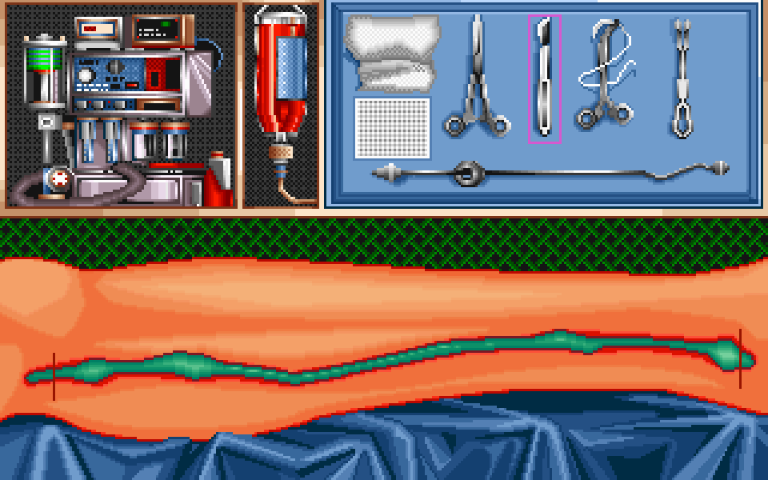

2. 用鉗子撐開切口。

    

3. 用止血鉗夾住露出的靜脈。

    

4. 空手在靜脈上打結（取下止血鉗）。

    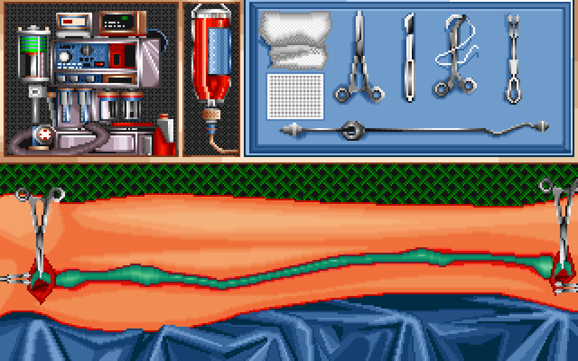

5. 用手術刀切斷靜脈兩端。

    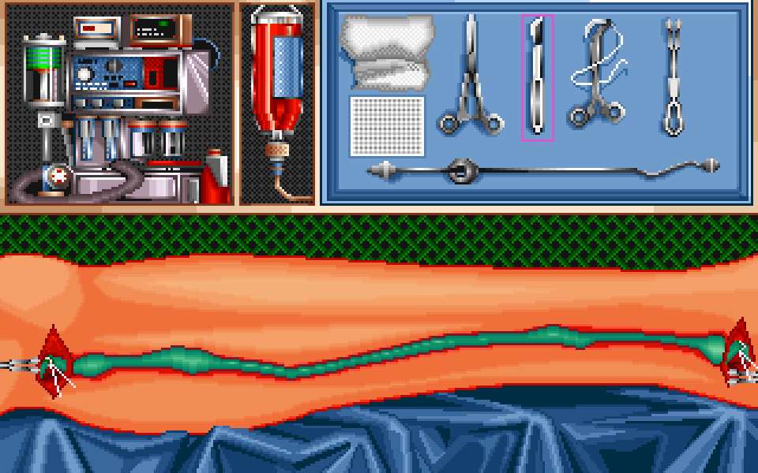

**會合：**

6. 用靜脈剝離器從膝蓋端的切口伸入靜脈（需兩端都完成步驟 5）。

    

7. 空手抽出剝離器，再取下兩邊的鉗子。

    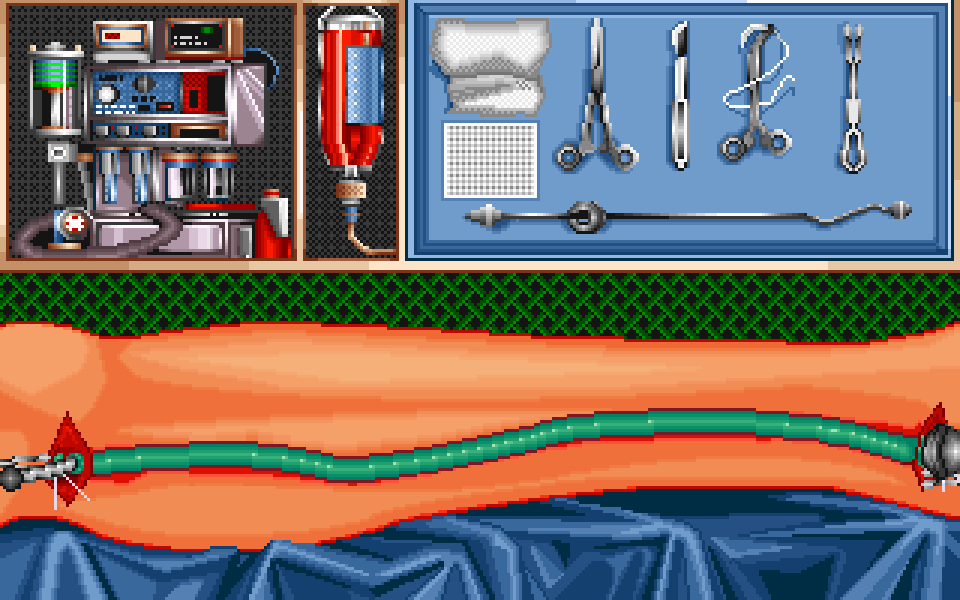

    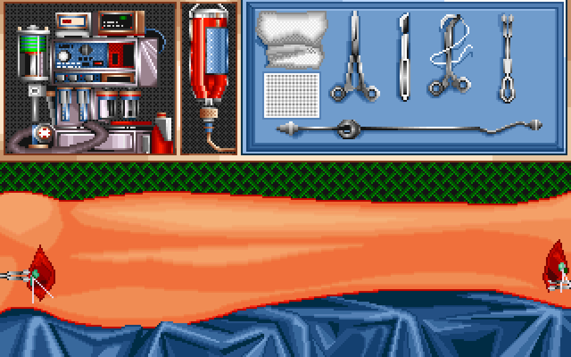

**收尾：**

8. 用縫線縫合兩個切口（**每邊各 ≥ 6 針**）。

    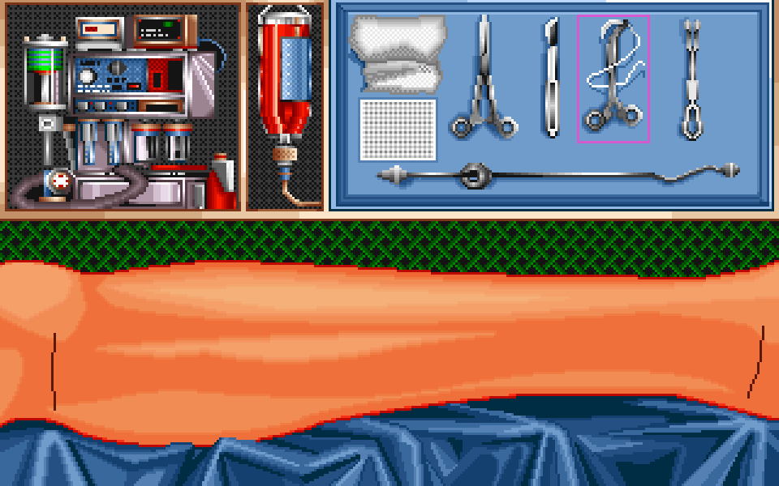

9. 用紗布覆蓋兩邊縫合後的切口。

    

10. 用繃帶包裹整隻小腿 → 結束。

    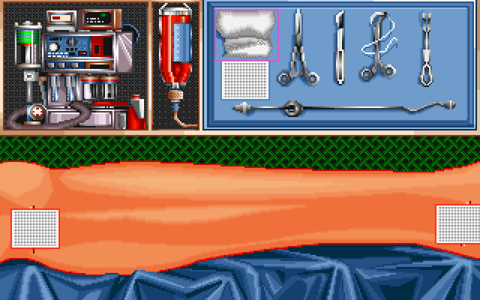

    

### 失敗條件
- **切錯地方**：不會引發出血，但會在結束後被判定失敗。
- **亂縫合**：傷口縫合時，未縫在切割線上的次數 > 6 針。
- **縫合不足**：傷口縫合時某一邊 < 6 針。
- 漏做紗布或繃帶；逾時。

---

## 輸卵管結紮術
**Tubal Ligation** ｜ 婦產科手術
- 流程上雖然需要將兩側的卵巢結紮，但由於遊戲切割開口的大小限制，因此只需針對一邊的卵巢進行即可（另一側的進度會自動更新）。一開始下刀的位置若過於置中，反而容易導致無法看見需要互動的地點而增加難度，建議根據想進行操作的一側調整下刀位置。本攻略用右側卵巢做示範。

### 工具表
| 編號 | 工具 | 圖示 |
|---|---|---|
| f001 | 鉗子 (Clamp) |  |
| f002 | 剪刀 (Scissors) |  |
| f003 | 鑷子 (Tweezers) |  |
| f004 | 手術刀 (Scalpel) |  |
| f005 | 紗布 (Gauze) |  |
| f006 | 縫線 (Suture) |  |
| f008 | 牽引器 (Retractor) |  |

### 步驟
**開腹（四層）**：用手術刀切皮膚→脂肪→肌肉（每層空手撥開）；

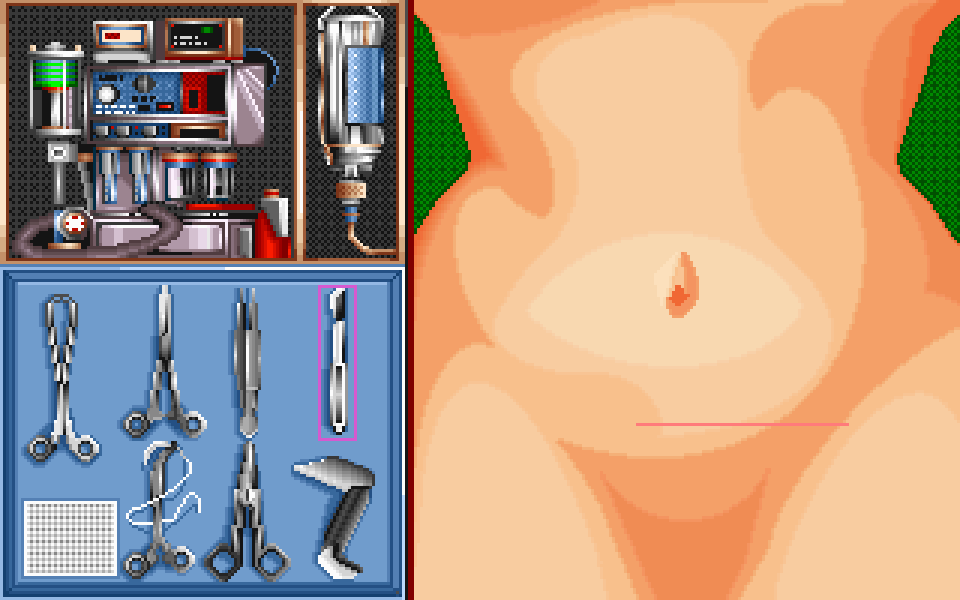

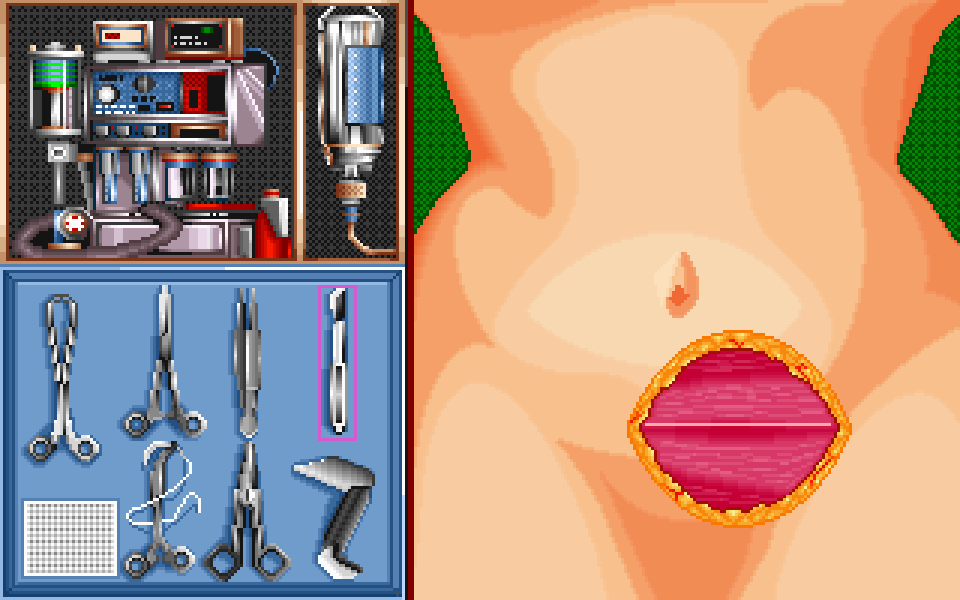

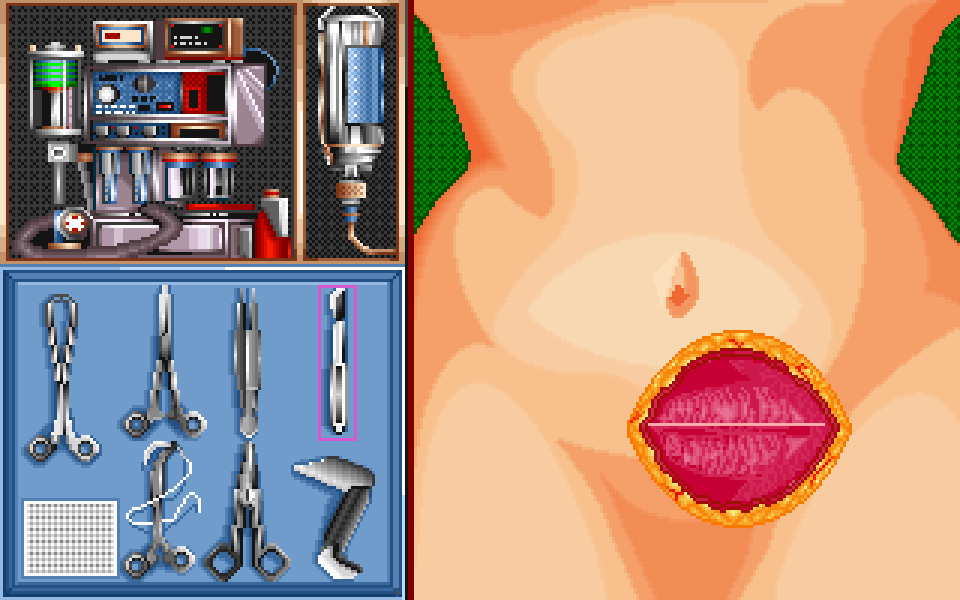

**腹膜用剪刀**（手術刀亦可）。接著牽引器撐開腹膜。

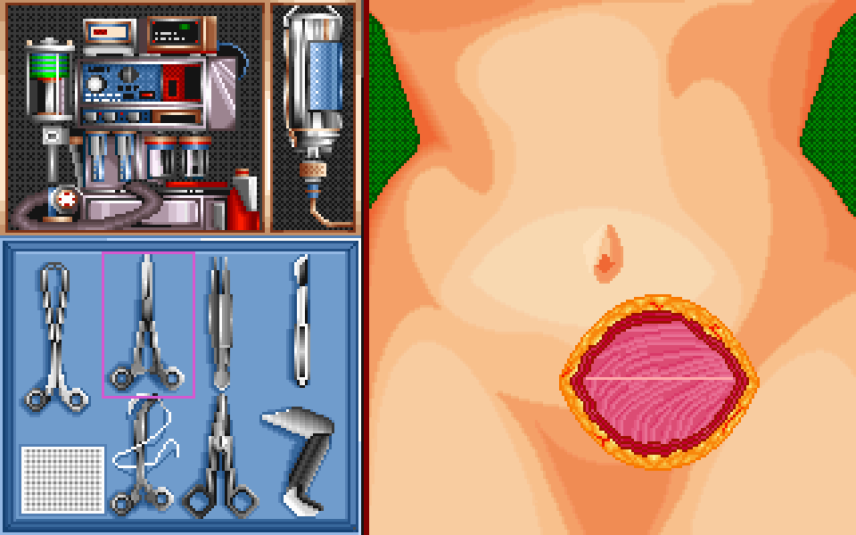

1. 🚨 **用紗布將腸子撥開** — **一定要拿紗布！** 此步驟若**空手**也會進入下一階段，
   但會在結束後**判定手術失敗**。

   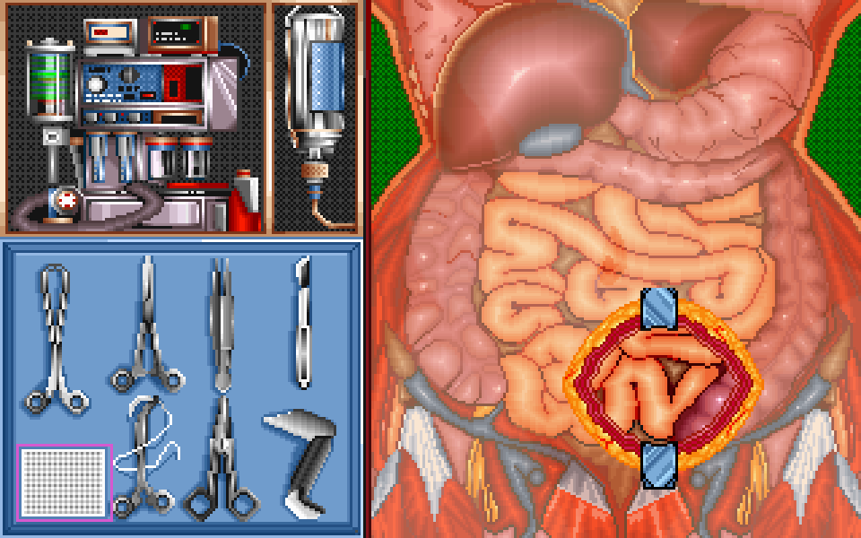

2. 用鉗子拉出卵巢。

   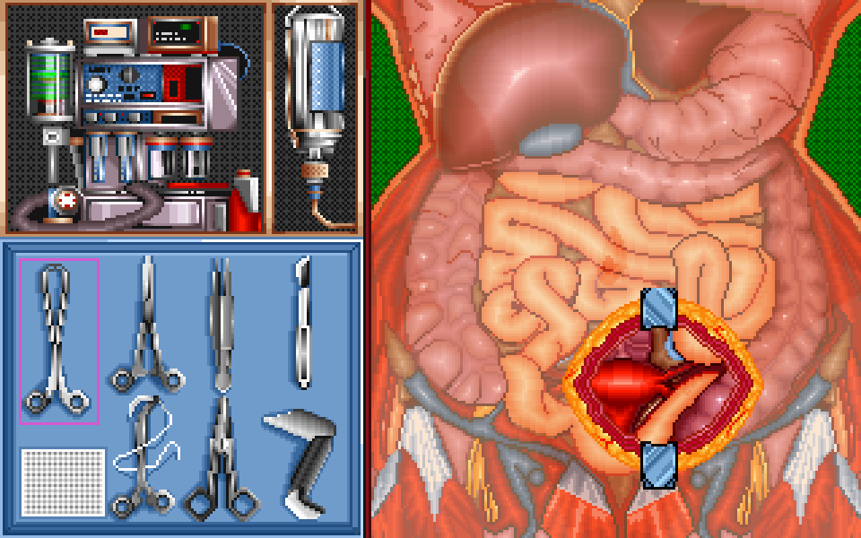

3. 空手在輸卵管靠**子宮**處打結。

   

4. 空手在輸卵管靠**卵巢**處打結。

   

5. **用手術刀** 將輸卵管從兩個結中切斷（點擊一次即可）。

   

6. **用手術刀**在子宮上開一個洞（點擊一次即可）— ⚠️ 用剪刀會導致手術失敗。

   

7. 用鑷子將輸卵管塞進子宮上的洞裡。

   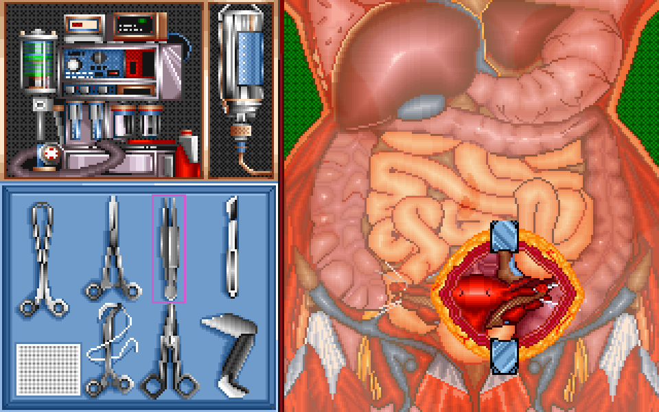

8. 空手取下牽引器。

   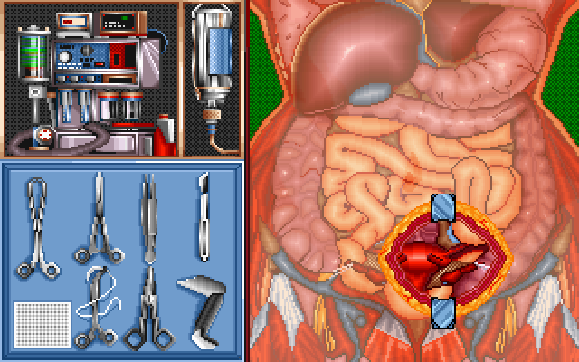

9. 用縫線縫合傷口（≥ 10 針）。

   

10. 關閉麻醉 → 結束。

### 失敗條件
- 🚨 **撥開腸子時沒有使用紗布** 這是本作唯一「空手可以操作但會判定失敗」的陷阱。**務必拿紗布。**
- 切斷輸卵管、開洞**只能用手術刀**（剪刀會出血）。
- 縫合過多 / 不足；逾時。

---
