# 瘋狂醫院２超級醫生 — 手術攻略（Surgery Walkthrough）

> 本檔案整理《瘋狂醫院２超級醫生》四項開刀房手術的完整步驟
> 婦產科／整形科的「治療」手術列於文末（步驟尚待驗證）。

---

## 目錄
- [通用規則](#通用規則)
- [闌尾切除術 (Appendectomy)](#闌尾切除術)
- [膽囊切除術 (Cholecystectomy)](#膽囊切除術)
- [內部靜脈剝除術 (Vein Stripping)](#內部靜脈剝除術)
- [輸卵管結紮術 (Tubal Ligation)](#輸卵管結紮術)
- [婦產科／整形科治療手術](#婦產科整形科治療手術)

---

## 通用規則

- **工具編號因手術而異！** 同一個 fNNN 在不同手術代表不同工具（不同手術用不同的 `.BLK` 圖庫），
  請以各手術自己的「工具表」為準。
- **點擊方式：** 多數步驟為左鍵點擊／拖曳；少數步驟需**右鍵**（會特別註明）。
- **空手（不拿工具）：** 開皮層、打結、取下器械等步驟需要空手。在多數手術中，於需要工具的地方空手點擊
  「不會有反應」（既不前進也不失敗）——**唯一例外是輸卵管結紮術的紗布步驟**（見該節警告）。
- **共同失敗條件：**
  - 切割時下刀太深／歪斜／偏離切線 → 出血失敗。
  - 縫合針數不足或過多（各手術門檻不同）。
  - 拖太久（病人耐心耗盡）→ 逾時失敗。
  - 一旦失敗旗標被設定即無法清除，本次手術必須重來。

---

## 闌尾切除術
**Appendectomy** ｜ 內科開刀房 ｜ 處理程式 `0x904B` ｜ 工具圖庫：`OPERATE3.BLK`

> ⚠️ 注意：本手術的工具編號與「膽囊切除術」不同（共用 OPERATE3.BLK）。

### 工具表
| 編號 | 工具 | 圖示 |
|---|---|---|
| f001 | 止血鉗 (Hemostat) | 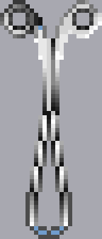 |
| f002 | 剪刀 (Scissors) | 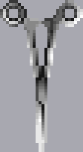 |
| f004 | 手術刀 (Scalpel) |  |
| f006 | 縫線／持針器 (Suture) | 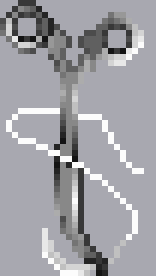 |
| f007 | 鉗子 (Forceps) | 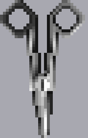 |
| f008 | 牽引器 (Retractor) |  |

### 步驟
**開腹（四層，每層：手術刀切開 → 空手撥開）**
1. 手術刀 (f004) 切開**皮膚**，再用手撥開。
2. 手術刀切開**皮下脂肪**，再用手撥開。
3. 手術刀切開**肌肉**，再用手撥開。
4. **剪刀 (f002) 切開腹膜** — ⚠️ **只能用剪刀，手術刀必出血**（本手術特有）。

**體內處理**
5. 牽引器 (f008) 撐開腹膜。
   
6. 止血鉗 (f001) 拉出闌尾。
   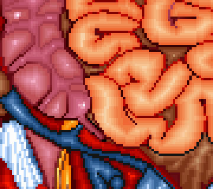
7. 剪刀 (f002) 或手術刀切斷連結的膜（此處兩者皆可）。
   
8. 鉗子 (f007)**右鍵**夾住闌尾尾端。
9. 縫線 (f006) 在闌尾根部打結（點一下）。
   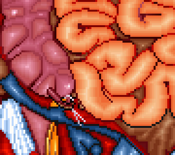
10. 手術刀切斷闌尾（點一下）。
11. 空手取下鉗子。
    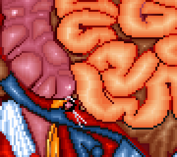
12. 縫線縫合斷面（點一下）。
    
13. 空手拆掉繩結。
    
14. 縫線縫合大腸尾端。
    
15. 空手取下牽引器。
16. 縫線縫合傷口（沿著線縫，總針數 ≥ 10）。
17. 關閉麻醉（畫面左上角的機器）→ 結束。

### 失敗條件
- **腹膜用手術刀**（第 4 層）→ 必出血。請用剪刀。
- **縫合過多**：傷口縫合時，新起的結超過 3 個 → 失敗。請沿著既有的線縫。
- **縫合不足**：傷口縫合 < 10 針。
- 切割下刀太深／歪斜；逾時。
- 本手術**沒有空手致命陷阱**——空手點錯地方只是不前進。

---

## 膽囊切除術
**Cholecystectomy** ｜ 內科開刀房 ｜ 處理程式 `0x9D3C` ｜ 工具圖庫：`OPERATE1.BLK`

### 工具表
| 編號 | 工具 | 圖示 |
|---|---|---|
| f001 | 電燒刀 (Electrocautery) |  |
| f002 | 組織鉗 (Tissue grasper) |  |
| f004 | 手術刀 (Scalpel) |  |
| f005 | 剪刀 (Scissors) | 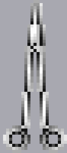 |
| f006 | 紗布 (Gauze) |  |
| f007 | 鑷子 (Tweezers) |  |
| f008 | 持針器／縫線 (Suture) | 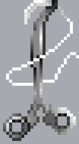 |
| f009 | 牽引器 (Retractor) | 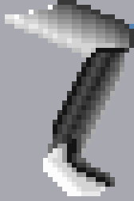 |

### 步驟
**開腹（四層）**：手術刀 (f004) 切皮膚→脂肪→肌肉（每層後空手撥開）；
下刀的位置會影響露出器官之後的可視範圍。撐開的洞大小是固定的，並不是割開愈長就可以打開更大的範圍。
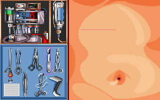
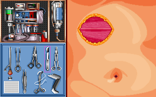
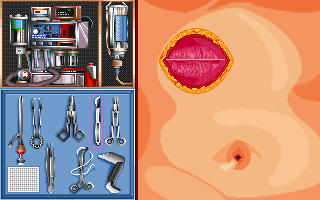

**腹膜可用剪刀 (f005) 或手術刀**（本手術兩者皆可）。
1. 牽引器 (f009) 撐開腹膜。
   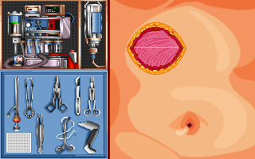
   接下來會用半透明的方式方便讓玩家看到每個操作實際的影響。在真正的遊戲中是只看得到洞中的範圍的。
2. 紗布 (f006) 包住肝臟。
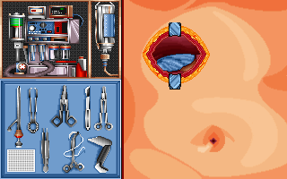
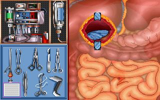
3. 牽引器拉出膽囊。
   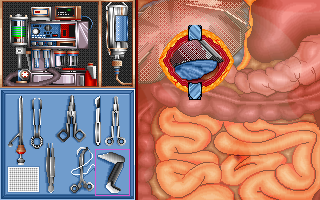
4. 電燒刀 (f001) 切斷上緣。
   
   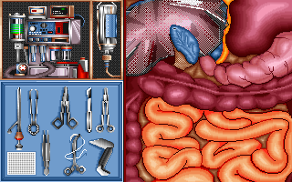
5. 鑷子 (f007) 拉出連結的膜。
   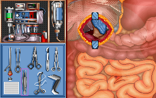
6. **剪刀 (f005) 切斷膜** — ⚠️ 此處**只能用剪刀**，手術刀無效。
   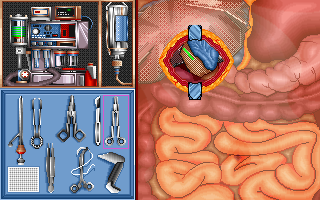
7. 組織鉗 (f002) 去除剩餘的膜。
   
8. **手術刀 (f004)** 切斷下緣血管①（只能用手術刀）。
   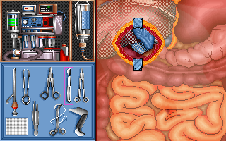
9. 空手在血管處打結。
   
10. **手術刀**切斷下緣血管②。
    
11. 空手在血管處打結。
    
12. 空手移除膽囊。
    
13. 空手移除包住肝臟的紗布。
    
14. 空手取下牽引器。
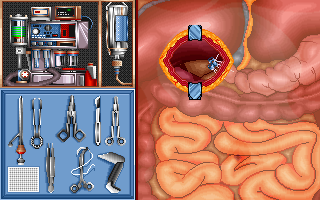
15. 持針器 (f008) 縫合傷口（≥ 10 針）。

16. 關閉麻醉 → 結束。

### 失敗條件
- **切膜（步驟 6）只能用剪刀；切血管（步驟 8、10）只能用手術刀。** 用錯工具不會前進。
- **縫合不足，縫在不是切割處的地方**（同闌尾：縫歪數 ≤ 3、總針數 ≥ 10）。
- 開腹切割太深／歪斜；逾時。

---

## 內部靜脈剝除術
**Vein Stripping** ｜ 外科開刀房 ｜ 處理程式 `0xAA5B` ｜ 工具圖庫：`OPERATE2.BLK`

> 本手術**沒有開皮層階段**；分**左右兩端各自獨立**進行，最後在中段會合。

### 工具表
| 編號 | 工具 | 圖示 |
|---|---|---|
| f001 | 繃帶 (Bandage) | 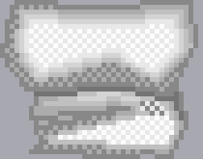 |
| f002 | 止血鉗 (Hemostat) | 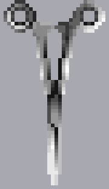 |
| f003 | 手術刀 (Scalpel) |  |
| f004 | 持針器 (Suture) | 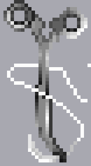 |
| f005 | 鉗子 (Forceps) | 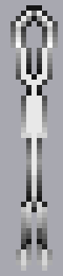 |
| f006 | 紗布 (Gauze) |  |
| f007 | 靜脈剝離器 (Vein stripper) |  |

### 步驟
**左右兩端各做一次（每端的流程相同）：**
1. 手術刀 (f003) 切開靜脈兩端靠近尖端處的皮膚。
2. 鉗子 (f005) 撐開切口。（⚠️ 必須先切開才能撐開——程式會檢查刀痕）
3. 止血鉗 (f002) 夾住露出的靜脈。
4. 空手在靜脈上打結（取下止血鉗）。
5. 手術刀切斷靜脈端。

**會合：**
6. 靜脈剝離器 (f007) 從膝蓋端的切口伸入靜脈（需兩端都完成步驟 5）。
7. 空手抽出剝離器，再空手取下兩邊的鉗子。

**收尾：**
8. 持針器 (f004) 縫合兩個切口（**每邊各 ≥ 6 針**）。
9. 紗布 (f006) 覆蓋兩邊縫合後的切口。
10. 繃帶 (f001) 包裹整隻小腿 → 結束。

> 畫面對照（步驟與影格的詳細對應待補）：
> 

### 失敗條件
- **切割下刀太深** → 失敗（`[0x165C]>4` 或 `[0x165E]>6`）。
- **縫合過多**（總數 > 6）或**某一邊不足 6 針** → 失敗。
- 漏做紗布或繃帶；逾時。
- **沒有空手致命陷阱**——空手步驟（打結、抽剝離器、取鉗子）安全。

---

## 輸卵管結紮術
**Tubal Ligation** ｜ 婦產科開刀房 ｜ 處理程式 `0x8413` ｜ 工具圖庫：`OPERATE3.BLK`

> ⚠️ **本手術有「空手致命陷阱」**——見步驟 1（紗布）的警告。

### 工具表
| 編號 | 工具 | 圖示 |
|---|---|---|
| f001 | 鉗子 (Clamp) |  |
| f002 | 剪刀 (Scissors) |  |
| f003 | 鑷子 (Tweezers) |  |
| f004 | 手術刀 (Scalpel) |  |
| f005 | 紗布 (Gauze) |  |
| f006 | 縫線 (Suture) |  |
| f008 | 牽引器 (Retractor) | 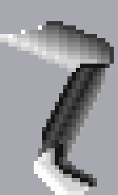 |

### 步驟
**開腹（四層）**：手術刀切皮膚→脂肪→肌肉（每層空手撥開）；
**腹膜用剪刀 (f002)**（手術刀亦可）。接著牽引器 (f008) 撐開腹膜。

1. 🚨 **紗布 (f005) 將腸子撥開** — **必須拿紗布！** 此步驟若**空手**也會前進，
   但會在手術最後**判定失敗**（致命陷阱）。
   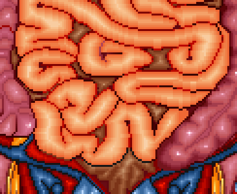
2. 鉗子 (f001) 拉出卵巢。
   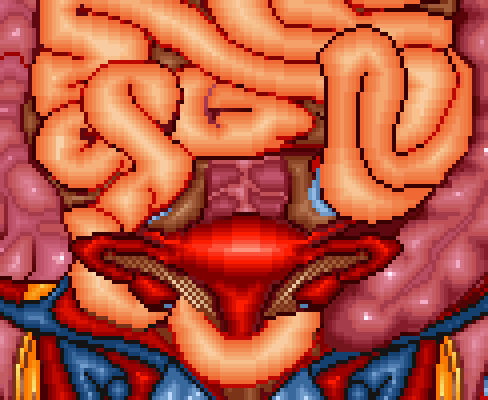
3. 空手在輸卵管靠**子宮**處打結。
   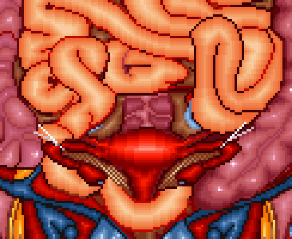
4. 空手在輸卵管靠**卵巢**處打結。
   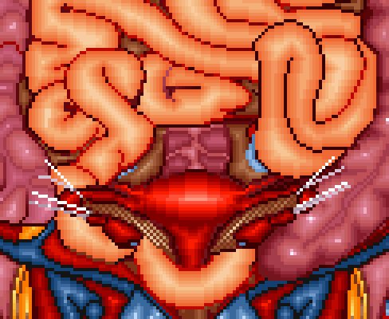
5. **手術刀 (f004)** 將輸卵管從兩個結中切斷（點一下）。
   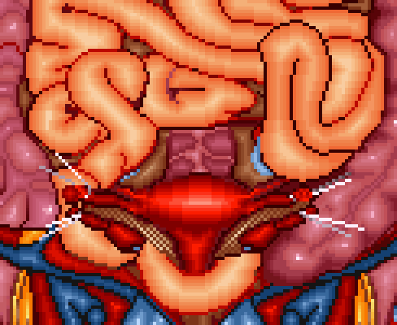
6. **手術刀**在子宮上開一個洞（點一下）— ⚠️ 用剪刀會出血。
   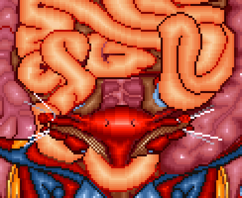
7. 鑷子 (f003) 將輸卵管塞進子宮上的洞裡。
   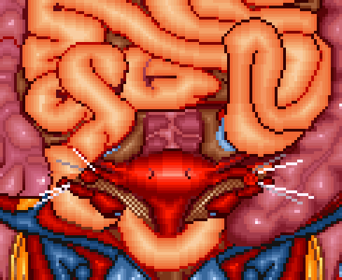
8. 空手取下牽引器。
9. 縫線 (f006) 縫合傷口（≥ 10 針）。
10. 關閉麻醉 → 結束。

### 失敗條件
- 🚨 **步驟 1（紗布）空手＝必敗。** 這是本作唯一「空手會前進但判定失敗」的陷阱
  （遊標在 X 200–261、Y 120–163 範圍內空手點擊即觸發）。**務必拿紗布。**
  （拉卵巢／切割等其他步驟空手點擊只是不前進，不會致命。）
- 切膜、開洞**只能用手術刀**（剪刀會出血）。
- 縫合過多 / 不足；逾時。

---

## 婦產科／整形科治療手術

> 以下「治療」型手術（非開刀房）目前**僅有概要**，逐步流程尚待反組譯驗證。

### 整形科（STATUS2.CST）
| 編號 | 手術 | 圖庫 | 步數 | 狀態 |
|---|---|---|---|---|
| 1 | 隆乳 | cure21.blk | 7 | 待驗證 |
| 2 | 拉皮 | cure22.blk | 4 | 待驗證 |
| 3 | 隆鼻 | cure23.blk | 4 | 待驗證 |
| 4 | 割雙眼皮 | cure24.blk | 4 | 待驗證 |

### 婦產科（STATUS3.CST）
| 編號 | 手術 | 圖庫 | 步數 | 狀態 |
|---|---|---|---|---|
| 1 | 子宮抹片檢查 | cure31.blk + misc.blk | 7 | 待驗證 |
| 2 | 子宮內避孕器 | cure32.blk | 3 | 待驗證 |
| 3 | 羊膜穿刺術 | cure33.blk | 4 | 待驗證 |
| 4 | 結紮 | OPERATE3.BLK | 13 | **同「輸卵管結紮術」** |

---

*資料來源：`OP0.EXE` 反組譯（處理程式 0x8413/0x904B/0x9D3C/0xAA5B）逐步驗證，並經實機確認。
詳細的旗標鏈與位址記錄於 `surgery_steps.txt`。*
